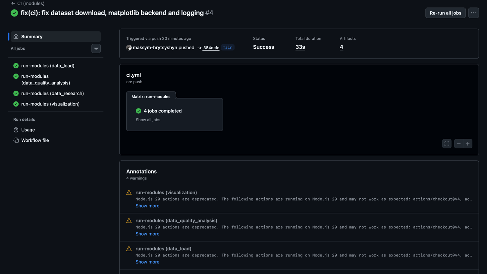
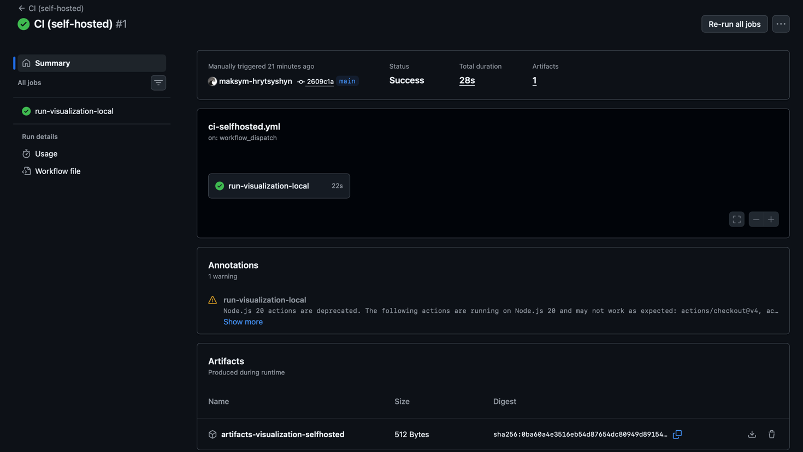
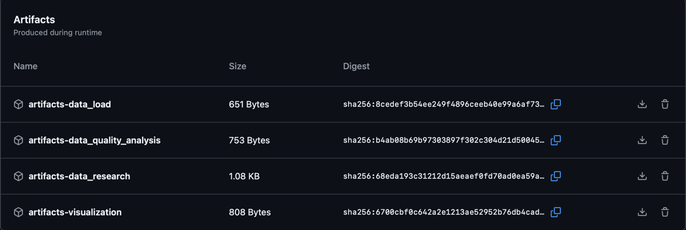
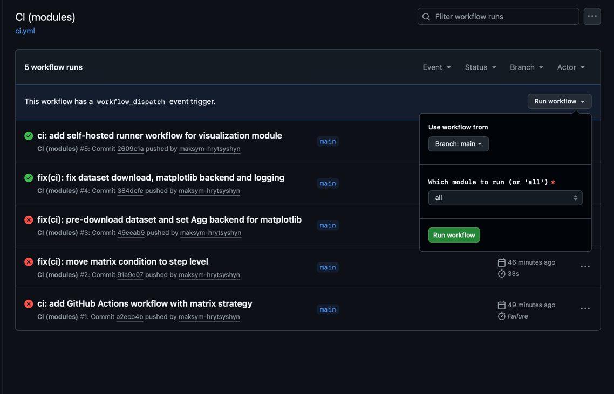

# Звіт: Побудова CI-конвеєра із використанням GitHub Actions

## Мета: 
- Налаштувати CI: автоматичний запуск модульних задач (тести/лінт/збірка/перевірки) при push/pull_request.

- Налаштувати CD (умовно): публікація артефактів (логів, звітів, графіків) та/або деплой результатів (наприклад, у GitHub Pages) після успішного CI.

- Навчитись запускати pipeline:

  1) на GitHub-hosted runners (хмара GitHub),

  2) на self-hosted runners (локальний ПК/сервер/WSL).

## Частина A — CI з matrix strategy
Workflow `ci.yml` запускає 4 модулі паралельно через matrix strategy
на GitHub-hosted runner (ubuntu-latest, Python 3.11).
Тригери: push/pull_request у main, ручний запуск з вибором модуля.

## Частина B — Артефакти
Після кожного run зберігаються артефакти: логи виконання кожного модуля
і PNG-графіки від visualization. Реалізовано через `actions/upload-artifact@v4`.

## Частина C — Self-hosted runner
Підключено локальний runner на MacBook Air M4 (macOS, ARM64).
Workflow `ci-selfhosted.yml` запускає модуль visualization вручну.

## Структура CI/CD

### ci.yml
- Тригери: push/PR у main, ручний запуск з вибором модуля
- Matrix strategy: 4 модулі паралельно
- Runner: ubuntu-latest (GitHub-hosted)
- Кроки: checkout → setup Python → install deps → download dataset → run module → upload artifacts

### ci-selfhosted.yml  
- Тригер: тільки ручний (workflow_dispatch)
- Runner: self-hosted macOS ARM64 (локальний MacBook)
- Модуль: visualization

## Посилання на runs
- CI (modules) успішний run: https://github.com/maksym-hrytsyshyn/open-data-ai-analytics/actions/runs/25483928278
- CI (self-hosted) успішний run: https://github.com/maksym-hrytsyshyn/open-data-ai-analytics/actions/runs/<ID>

### Порівняння GitHub-hosted vs Self-hosted

| Критерій | GitHub-hosted | Self-hosted |
|---|---|---|
| Час виконання | 33s | 28s |
| ОС | ubuntu-latest | macOS ARM64 |
| Python | встановлюється з нуля | вже наявний у системі |
| Доступ до даних | тільки через інтернет | прямий доступ до локальних файлів |
| Стабільність | гарантована GitHub | залежить від стану ПК |
| Безпека | ізольоване середовище | runner має доступ до системи |

### Ризики self-hosted runner
- Runner offline якщо ПК вимкнений або термінал закритий.
- Має повний доступ до локальної машини — небезпечно для публічних репозиторіїв.
- Залежності треба підтримувати вручну.

### Переваги self-hosted runner
- Швидший старт (не треба встановлювати Python).
- Доступ до великих локальних датасетів без завантаження.
- Безкоштовно (не витрачає GitHub Actions minutes).

## Ілюстрації роботи pipeline

### CI (modules) — 4 паралельних job (GitHub-hosted)


### CI (self-hosted) — виконання на локальному Mac


### Список збережених артефактів


### Ручний запуск з вибором модуля


### Лог self-hosted runner (термінал на локальному ПК)
```
√ Connected to GitHub
Current runner version: '2.334.0'
2026-05-07 08:03:57Z: Listening for Jobs
2026-05-07 08:08:15Z: Running job: run-visualization-local
2026-05-07 08:08:37Z: Job run-visualization-local completed with result: Succeeded
```
Job виконався за ~22 секунди безпосередньо на локальному MacBook Air M4.


## Висновок
CI/CD pipeline успішно налаштований для проєкту аналізу макроекономічних 
даних України. GitHub Actions автоматично перевіряє всі 4 модулі при кожному 
push у main. Self-hosted runner на локальному Mac показав кращий час виконання 
(28s vs 33s) завдяки відсутності необхідності встановлювати залежності з нуля, 
і має прямий доступ до локальних датасетів без завантаження через інтернет.