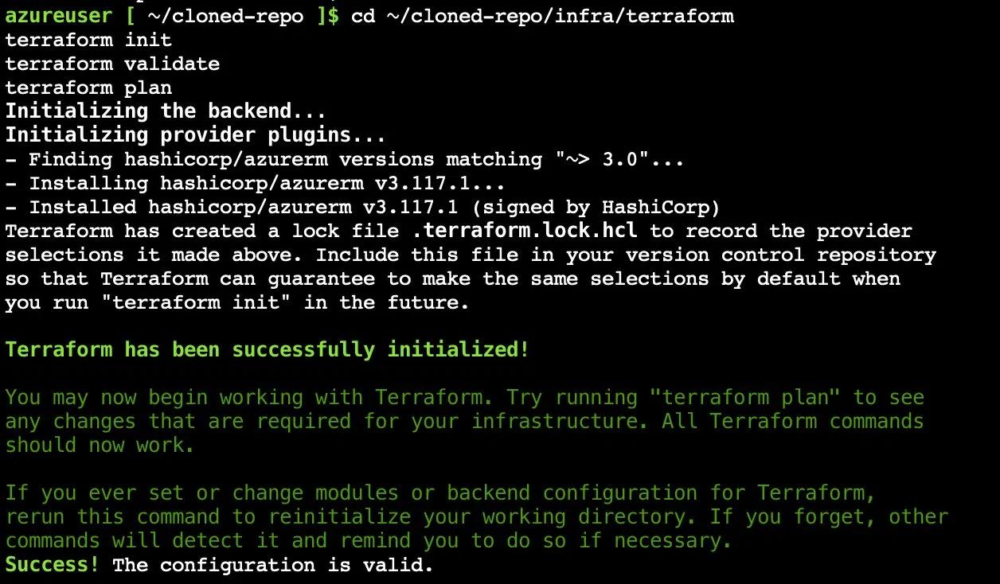
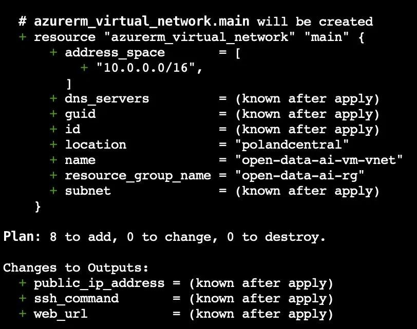
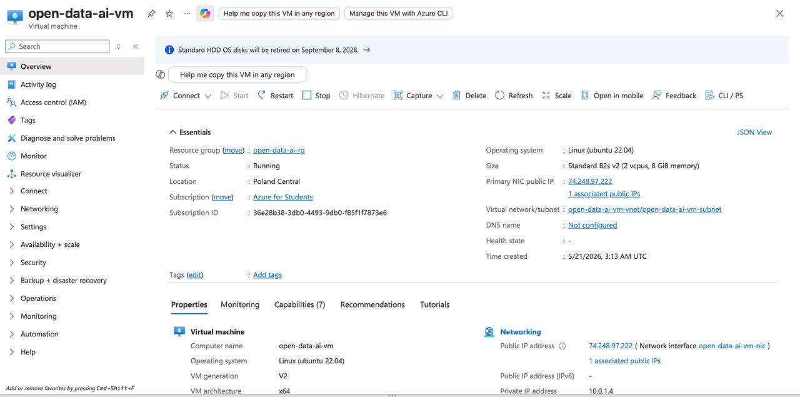
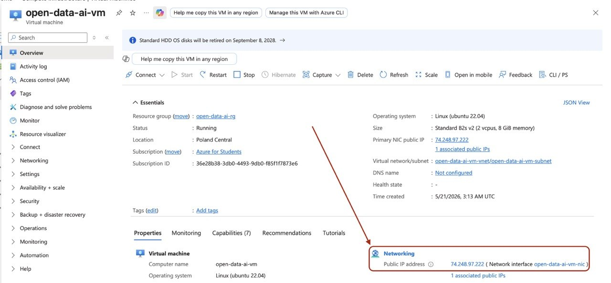
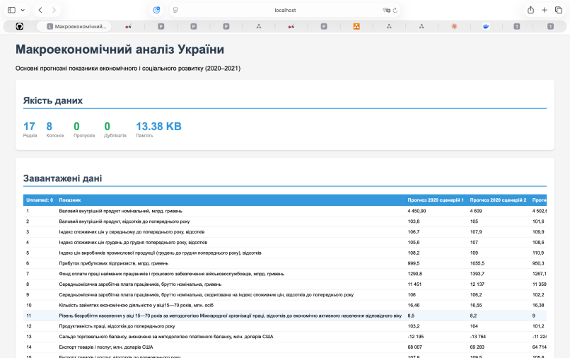
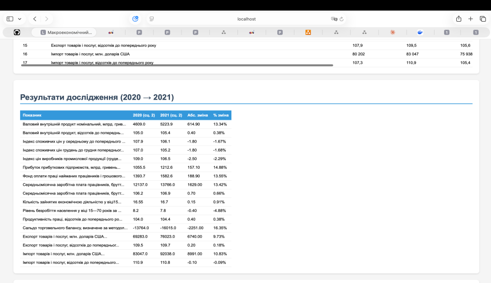
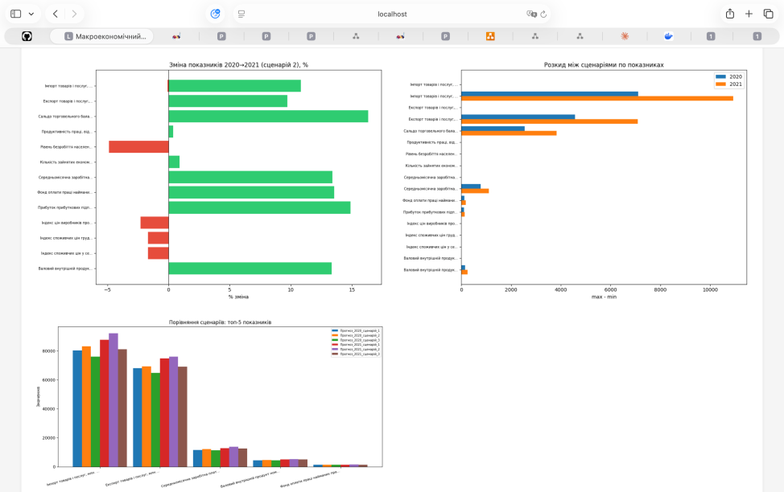

# Звіт з лабораторної роботи №6
**Тема:** Інфраструктура як код. Terraform + Azure Cloud Shell + cloud-init  
**Студент:** Максим Грицишин | ШІ-2023

---

## Мета роботи

Навчитися розгортати Docker-проєкт у Microsoft Azure без локального середовища, використовуючи Terraform для створення інфраструктури та cloud-init для автоматичного налаштування VM.

---

## 1. Які ресурси створює Terraform

Terraform-конфігурація у каталозі `infra/terraform/` створює 7 ресурсів Azure:

| Ресурс | Назва | Призначення |
|--------|-------|-------------|
| `azurerm_resource_group` | open-data-ai-rg | Логічний контейнер усіх ресурсів |
| `azurerm_virtual_network` | open-data-ai-vm-vnet | Ізольована мережа 10.0.0.0/16 |
| `azurerm_subnet` | open-data-ai-vm-subnet | Підмережа 10.0.1.0/24 |
| `azurerm_public_ip` | open-data-ai-vm-pip | Статична публічна IP-адреса |
| `azurerm_network_security_group` | open-data-ai-vm-nsg | Фаєрвол (порти 22 і 5001) |
| `azurerm_network_interface` | open-data-ai-vm-nic | Мережевий інтерфейс VM |
| `azurerm_linux_virtual_machine` | open-data-ai-vm | Ubuntu 22.04, Standard_B2s_v2 |

**Параметри VM:**
- Регіон: Poland Central
- Розмір: Standard_B2s_v2 (2 vCPU, 4 GB RAM)
- ОС: Ubuntu 22.04 LTS Gen2
- Диск: 30 GB Standard_LRS

NSG містить два правила безпеки:
- `AllowSSH` (пріоритет 100) — TCP порт 22
- `AllowWeb` (пріоритет 110) — TCP порт 5001

### Скріншот: terraform init + validate



### Скріншот: terraform plan



---

## 2. Що робить cloud-init

cloud-init — механізм автоматичного налаштування Linux VM при першому запуску. Terraform передає сценарій через поле `custom_data` у форматі base64.

Сценарій `cloud-init.yaml` виконує послідовно:

**1. Оновлення системи**
```yaml
package_update: true
package_upgrade: true
```

**2. Встановлення залежностей**  
Пакети: `curl`, `gnupg`, `ca-certificates`, `lsb-release`, `git`

**3. Встановлення Docker Engine**
```bash
curl -fsSL https://download.docker.com/linux/ubuntu/gpg -o /etc/apt/keyrings/docker.asc
apt-get install -y docker-ce docker-ce-cli containerd.io docker-buildx-plugin docker-compose-plugin
```

**4. Налаштування Docker**
```bash
systemctl enable docker
systemctl start docker
usermod -aG docker azureuser
```

**5. Клонування репозиторію**
```bash
git clone https://github.com/maksym-hrytsyshyn/open-data-ai-analytics /opt/app
```

**6. Запуск застосунку**
```bash
cd /opt/app && docker compose up -d
```

---

## 3. Як запускається Docker-проєкт

Проєкт описаний у файлі `compose.yaml` і містить 6 сервісів:

```
postgres → data_load → data_quality_analysis ┐
                     → data_research          ├→ web
                     → visualization          ┘
```

| Сервіс | Опис |
|--------|------|
| `postgres` | PostgreSQL 16, база даних `macro` |
| `data_load` | Завантажує CSV у PostgreSQL, healthcheck |
| `data_quality_analysis` | Аналіз якості даних |
| `data_research` | Порівняння сценаріїв 2020→2021 |
| `visualization` | Генерація графіків PNG |
| `web` | Flask на порту 5001:5000 |

**Спільні томи:**
- `pg_data` — дані PostgreSQL
- `shared_plots` — графіки між `visualization` та `web`
- `shared_reports` — звіти між аналітичними модулями та `web`

**Особливість розгортання в Azure:**  
Джерело даних `data.gov.ua` повертає HTTP 403 для Azure IP. Вирішено шляхом ручного завантаження CSV та монтування тому `./data:/app/data`. Скрипт `data_load.py` модифіковано для перевірки локального файлу перед завантаженням:

```python
local_path = RAW_DIR / DEFAULT_FILENAME
if local_path.exists():
    csv_path = local_path
else:
    csv_path = download()
```

---

## 4. Перевірка працездатності

### 4.1. Створена VM та public IP





- **Назва VM:** open-data-ai-vm
- **Статус:** Running
- **Розташування:** Poland Central
- **Public IP:** 74.248.97.222
- **Розмір:** Standard B2s v2 (2 vcpus, 8 GiB memory)

### 4.2. Перевірка через curl

З Azure Cloud Shell виконано:
```bash
curl http://74.248.97.222:5001
```
Отримано HTML-відповідь з повним вмістом сторінки (код 200).

### 4.3. Працюючий веб-інтерфейс







Веб-інтерфейс доступний за адресою `http://74.248.97.222:5001` і відображає:
- Таблицю якості даних (17 рядків, 8 колонок, 0 пропусків, 0 дублікатів)
- Повну таблицю макроекономічних показників України (2020–2021)
- Результати дослідження з порівнянням сценаріїв
- Три графіки: порівняння сценаріїв, розкид, динаміка змін (YoY)

### 4.4. Перевірка стану контейнерів

```bash
docker ps
```

```
CONTAINER ID   IMAGE          STATUS          PORTS                    NAMES
c540fa93e0bc   web            Up (healthy)    0.0.0.0:5001->5000/tcp   open-data-ai-analytics-web-1
1166ecdfae9f   data_load      Up (healthy)                             open-data-ai-analytics-data_load-1
5b0c3a7ac000   postgres:16    Up (healthy)    5432/tcp                 open-data-ai-analytics-postgres-1
ea679d5f358a   visualization  Exited (0)                               open-data-ai-analytics-visualization-1
2a99bf57770d   data_research  Exited (0)                               open-data-ai-analytics-data_research-1
0031ec8c4773   data_quality   Exited (0)                               open-data-ai-analytics-data_quality_analysis-1
```

Сервіси `data_quality_analysis`, `data_research`, `visualization` — завершились з кодом 0 (успішно), оскільки є одноразовими задачами.

### 4.5. Видалення ресурсів

Після демонстрації виконано:
```bash
terraform destroy
```
Всі 7 ресурсів Azure видалено для збереження студентського кредиту ($100).

---

## Висновки

У ході лабораторної роботи успішно реалізовано повністю хмарне розгортання:

- Написано Terraform-конфігурацію для 7 ресурсів Azure (регіон Poland Central)
- Розроблено cloud-init сценарій для автоматичного налаштування Ubuntu VM
- Розгорнуто 6-контейнерний Docker-проєкт без ручного входу на сервер
- Веб-інтерфейс доступний через публічну IP-адресу на порту 5001
- Вирішено проблему обмеженого доступу до джерела даних з Azure IP
- Набуто практичний досвід роботи з Infrastructure as Code у хмарі
