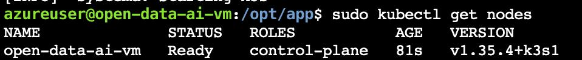
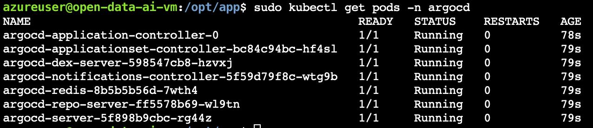
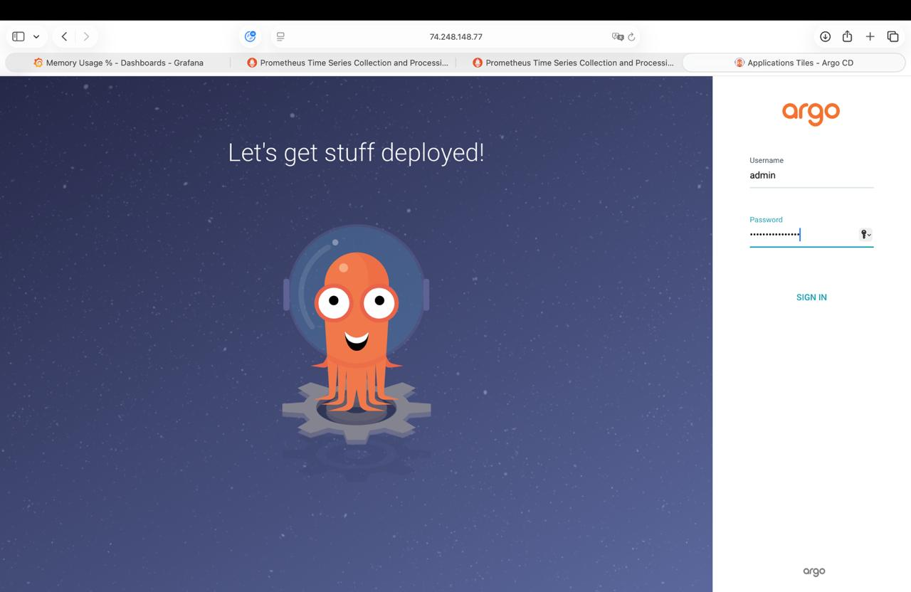
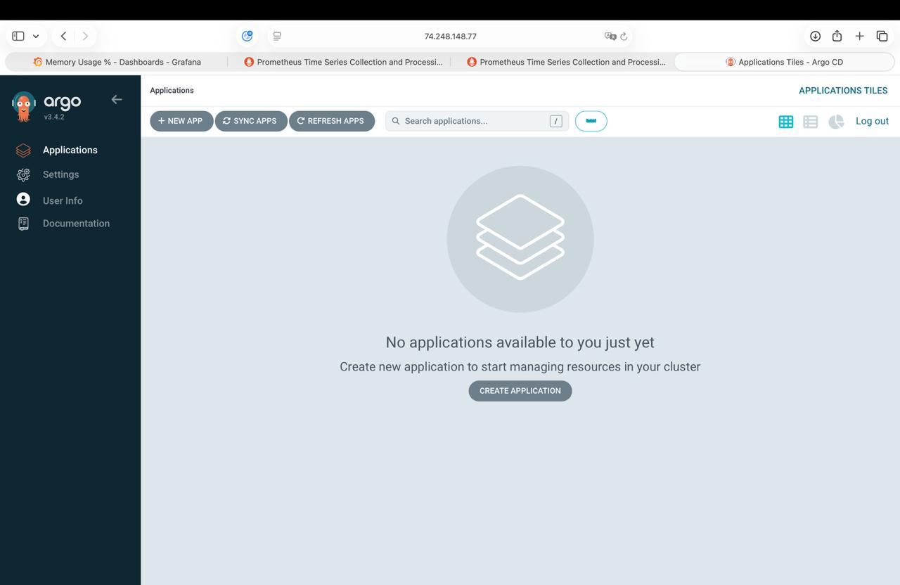
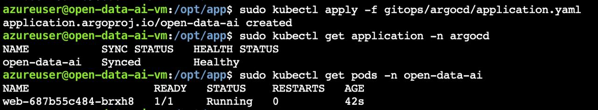
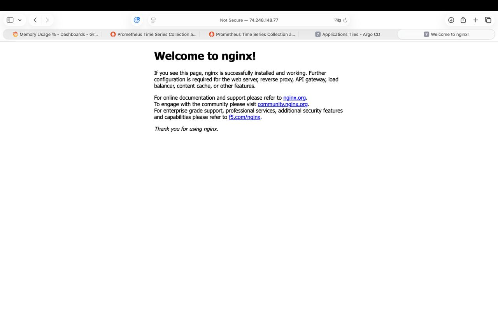
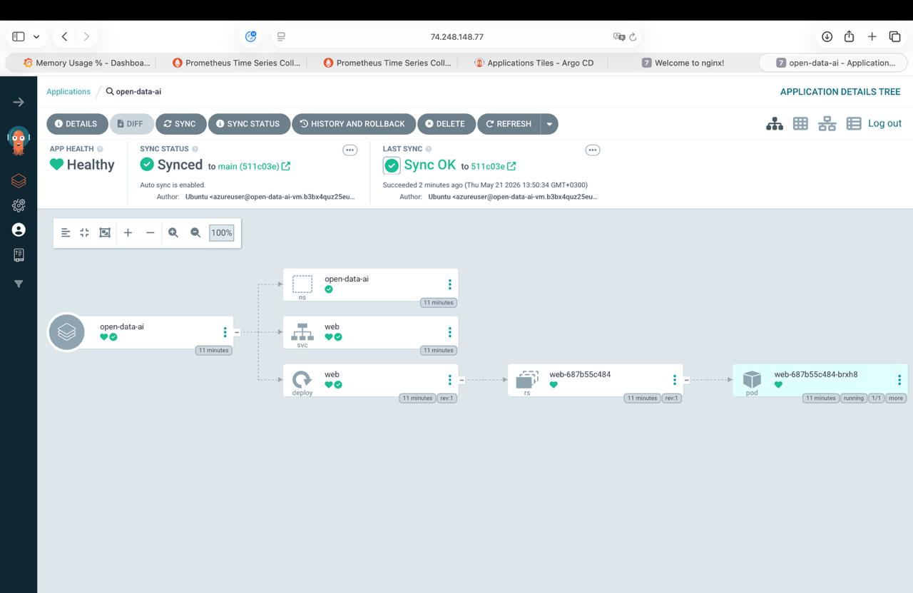
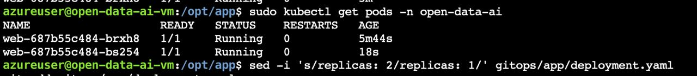
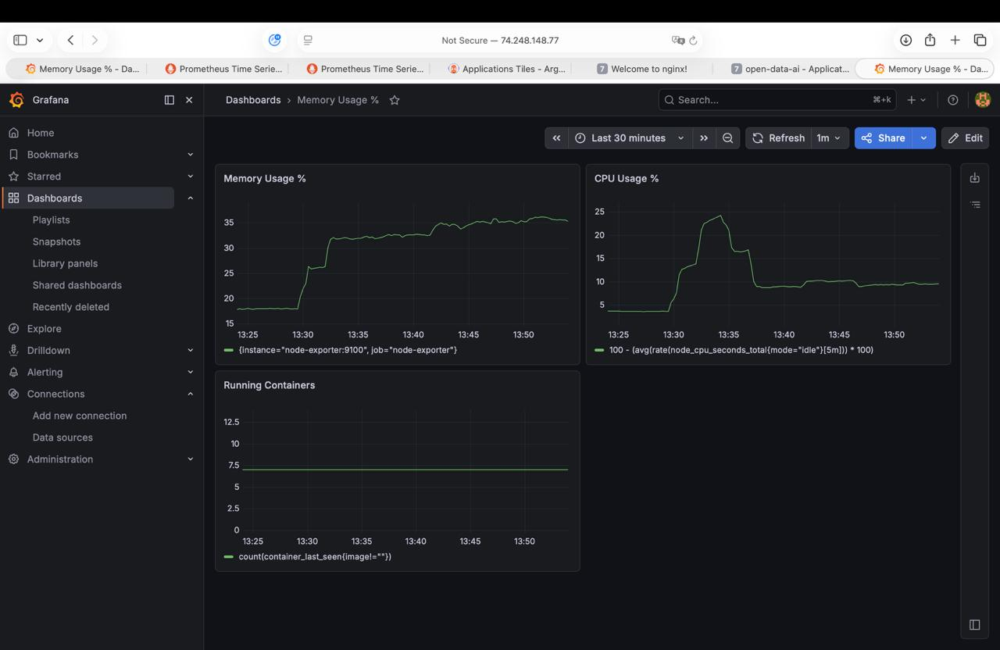

# Звіт з лабораторної роботи №6
**Тема:** Ознайомлення із практиками GitOps  
**Студент:** Максим Грицишин | ШІ-31

---

## Мета роботи

Ознайомитися з практикою GitOps та реалізувати автоматизоване розгортання застосунку в Kubernetes-середовище на основі змін у GitHub-репозиторії.

---

## 1. Опис підходу GitOps

GitOps — це підхід до розгортання та керування застосунками, за якого бажаний стан системи описується у Git-репозиторії, а спеціальний агент у кластері автоматично приводить реальний стан до того, що збережено в Git.

Основні принципи:
- **Git є джерелом істини** — вся конфігурація зберігається в репозиторії
- **Декларативний опис** — інфраструктура описується YAML-файлами
- **Автоматичне розгортання** — зміни в Git автоматично застосовуються в кластері
- **Rollback через Git** — повернення до попередньої версії через `git revert`

У цій роботі GitOps реалізовано через **Argo CD** — оператор для Kubernetes, який відстежує GitHub-репозиторій і синхронізує стан кластера.

---

## 2. Структура репозиторію

```
gitops/
├── app/
│   ├── namespace.yaml      # Kubernetes namespace
│   ├── deployment.yaml     # Deployment застосунку
│   └── service.yaml        # NodePort Service
└── argocd/
    └── application.yaml    # Argo CD Application
```

---

## 3. Основні YAML-файли

### namespace.yaml
```yaml
apiVersion: v1
kind: Namespace
metadata:
  name: open-data-ai
```

### deployment.yaml
```yaml
apiVersion: apps/v1
kind: Deployment
metadata:
  name: web
  namespace: open-data-ai
  labels:
    app: web
spec:
  replicas: 1
  selector:
    matchLabels:
      app: web
  template:
    metadata:
      labels:
        app: web
    spec:
      containers:
        - name: web
          image: nginx:alpine
          ports:
            - containerPort: 80
          env:
            - name: APP_VERSION
              value: "1.0.0"
```

### service.yaml
```yaml
apiVersion: v1
kind: Service
metadata:
  name: web
  namespace: open-data-ai
spec:
  selector:
    app: web
  ports:
    - protocol: TCP
      port: 80
      targetPort: 80
      nodePort: 30080
  type: NodePort
```

### argocd/application.yaml
```yaml
apiVersion: argoproj.io/v1alpha1
kind: Application
metadata:
  name: open-data-ai
  namespace: argocd
spec:
  project: default
  source:
    repoURL: https://github.com/maksym-hrytsyshyn/open-data-ai-analytics
    targetRevision: main
    path: gitops/app
  destination:
    server: https://kubernetes.default.svc
    namespace: open-data-ai
  syncPolicy:
    automated:
      prune: true
      selfHeal: true
    syncOptions:
      - CreateNamespace=true
```

---

## 4. Скріншоти

### 4.1. kubectl get nodes — кластер k3s активний



Вузол `open-data-ai-vm` у стані **Ready**, роль `control-plane`, версія k3s v1.35.4.

### 4.2. Поди Argo CD — всі Running



Всі 7 компонентів Argo CD запущені:
- argocd-application-controller
- argocd-applicationset-controller
- argocd-dex-server
- argocd-notifications-controller
- argocd-redis
- argocd-repo-server
- argocd-server

### 4.3. Вхід в Argo CD



Веб-інтерфейс Argo CD доступний за адресою `https://74.248.148.77:8443`.

### 4.4. Перший вхід — додатків ще немає



### 4.5. Застосунок Synced + kubectl підтвердження



Після `kubectl apply -f gitops/argocd/application.yaml`:
- Argo CD статус: **Synced / Healthy**
- Под `web-687b55c484-brxh8` — Running

### 4.6. Застосунок у браузері



Nginx доступний через `http://74.248.148.77:30080` — застосунок розгорнутий через GitOps.

### 4.7. Інтерфейс Argo CD зі станом Synced



Дерево ресурсів: `open-data-ai` → namespace + service + deployment → ReplicaSet → Pod (running 1/1). Auto sync is enabled.

---

## 5. Автоматичне оновлення через Git commit

### Commit який викликав оновлення

```bash
sed -i 's/replicas: 1/replicas: 2/' gitops/app/deployment.yaml
git add gitops/app/deployment.yaml
git commit -m "scale: increase replicas to 2"
git push
```

### Результат після автосинхронізації



Argo CD виявив зміну в GitHub і автоматично застосував її — з'явився другий под `web-687b55c484-bs254` без ручного `kubectl apply`.

---

## 6. Rollback

Для повернення до попереднього стану змінено `replicas: 2` назад на `replicas: 1` і запушено в GitHub:

```bash
sed -i 's/replicas: 2/replicas: 1/' gitops/app/deployment.yaml
git add gitops/app/deployment.yaml
git commit -m "rollback: decrease replicas back to 1"
git push
```

### Результат rollback


Argo CD автоматично видалив зайвий под — залишився 1 Running под, що відповідає стану в Git.

---

## 7. Перевірка сумісності з моніторингом



Після GitOps-розгортання Grafana залишається доступною. На дашборді видно:
- **CPU** стрибнув до ~25% під час встановлення k3s та Argo CD (13:30–13:35), потім стабілізувався на ~10%
- **RAM** зріс з ~20% до ~35% після запуску Kubernetes компонентів
- **Running Containers** стабільно = 7

Prometheus продовжує збирати метрики, дашборд працює.

---

## Висновки

У ході лабораторної роботи успішно реалізовано GitOps-підхід:

- Встановлено k3s (легкий Kubernetes) на Azure VM
- Встановлено Argo CD та підключено до GitHub-репозиторію
- Створено декларативні YAML-маніфести для namespace, deployment та service
- Продемонстровано автоматичне розгортання — зміна `replicas` в Git автоматично застосувалась у кластері без ручного `kubectl apply`
- Продемонстровано rollback через повернення змін у Git
- Підтверджено сумісність з моніторингом — Prometheus і Grafana продовжують працювати
EOF
